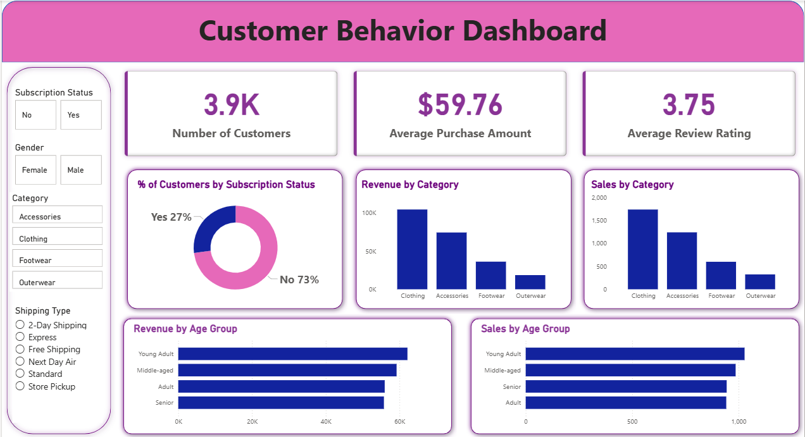

# 📊 Customer Shopping Behavior Analysis — Data Analytics Portfolio Project

An end-to-end data analytics project analyzing 3,900 retail transactions to uncover customer shopping trends, segment behavior, and drivers of purchase decisions — covering data cleaning (Python), business querying (SQL), and dashboarding (Power BI).

## 📌 Project Overview

**Business question:** How can a retail company use consumer shopping data to identify trends, improve customer engagement, and optimize marketing and product strategy?

**Workflow:**
1. **Data Preparation (Python)** — Cleaned and transformed the raw dataset (handled missing values, standardized columns, engineered `age_group` and `purchase_frequency_days` features)
2. **Data Analysis (SQL)** — Loaded cleaned data into PostgreSQL and ran business queries covering revenue by gender, customer segmentation, discount dependency, top products per category, and repeat-buyer subscription behavior
3. **Visualization (Power BI)** — Built an interactive dashboard with filters for subscription status, gender, category, and shipping type



4. **Reporting** — Summarized findings into a business report and stakeholder presentation

## 🔑 Key Findings

- Male customers generated ~2x the revenue of female customers ($157,890 vs $75,191)
- 3,116 of 3,900 customers fall into the "Loyal" segment based on purchase history
- Hats, sneakers, and coats are the most discount-dependent products (~48–50% of purchases discounted)
- Express shipping customers spend marginally more on average ($60.48 vs $58.46 for standard)
- Non-subscribers generate significantly higher total revenue despite lower per-customer averages — subscription program has room to grow

## 🛠️ Repo Contents

| File | Description |
|---|---|
| `customer_shopping_behavior.csv` | Raw dataset (3,900 rows, 18 columns) |
| `Customer_Shopping_Behavior_Analysis.ipynb` | Python notebook — data cleaning, EDA, feature engineering, SQL DB load |
| `customer_behavior_sql_queries.sql` | Business-question SQL queries (PostgreSQL) |
| `customer_behavior_dashboard.pbix` | Power BI interactive dashboard |
| `assets/dashboard_screenshot.png` | Dashboard preview image (for quick viewing without Power BI) |
| `Business_Problem_Document.pdf` | Business problem statement and deliverables |
| `Customer_Shopping_Behavior_Analysis_Report.pdf` | Final project report |
| `Customer-Shopping-Behavior-Analysis.pptx` | Stakeholder presentation deck |

## 🚀 How to Reproduce

1. **Clone the repo**
   ```bash
   git clone https://github.com/KumarOmSingh/customer-shopping-behavior-analysis.git
   cd customer-shopping-behavior-analysis
   ```
2. **Run the notebook** — `Customer_Shopping_Behavior_Analysis.ipynb` (data import, cleaning, PostgreSQL connection)
3. **Run SQL queries** — Load cleaned data into PostgreSQL, then execute `customer_behavior_sql_queries.sql`
4. **Open the dashboard** — `customer_behavior_dashboard.pbix` in Power BI Desktop, connect to your SQL database

## 📜 License

MIT — see [LICENSE](LICENSE.txt)

## 👨‍💻 About Me

**Om Kumar Singh** — MS Computer Science & Data Analytics student at IIT Patna (CEP), building a career in Data Science & AI.

- 🔗 LinkedIn: [linkedin.com/in/kumaromsingh](https://linkedin.com/in/kumaromsingh)
- 💻 GitHub: [github.com/KumarOmSingh](https://github.com/KumarOmSingh)
